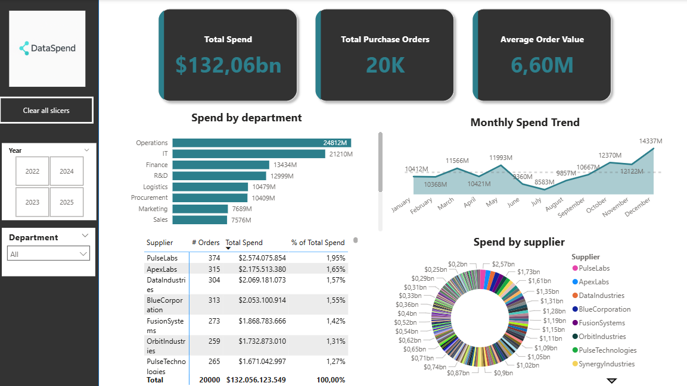
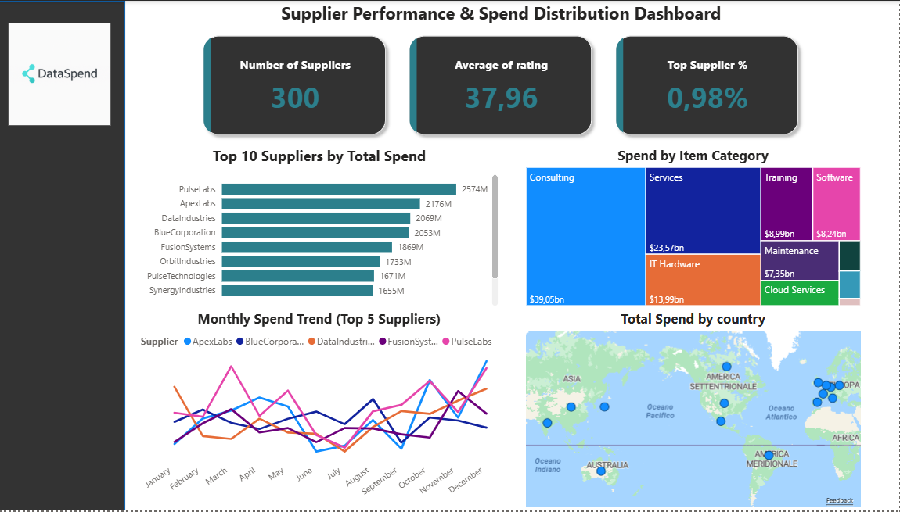

# 🧾 Procurement Spend Analytics Dashboard  
### Power BI • SQL • Business Intelligence  
**Bilingual README (EN / IT)**

---

## 🔎 Executive Project Summary (EN)

This project presents a **procurement spend analytics solution** designed to support **executive and managerial decision-making**.

Using **SQL and Power BI**, the analysis transforms raw transactional data into **clear, actionable insights** about:
- How company spending is distributed  
- Which departments and suppliers drive costs  
- Where concentration risk and optimization opportunities exist  

📌 **Role alignment:** Data Analyst | BI Analyst | Business Intelligence

---

## 🎯 Business Questions Answered (EN)

This dashboard answers key questions typically asked by leadership:

- Where is the company spending the most money?
- Which departments and suppliers have the biggest financial impact?
- How does spending evolve over time?
- Are we over-reliant on a small number of suppliers?
- How balanced is supplier performance?

---

## 🧠 Analytical Approach (EN)

**Data workflow**
1. Relational data modeling in PostgreSQL  
2. SQL transformations and aggregations  
3. Creation of reusable analytical views  
4. Visualization and KPI design in Power BI  

**Focus areas**
- Spend visibility and cost control  
- Supplier concentration and performance  
- Departmental budget monitoring  
- Time-based trend analysis  

---

## 🗂️ Data Model Overview (EN)

Five relational tables structured in a star-like model:

| Table | Purpose |
|------|--------|
| **purchase_orders** | Fact table with order totals and dates |
| **order_details** | Line-level transactional details |
| **departments** | Purchasing business units |
| **suppliers** | Supplier attributes and ratings |
| **items** | Product categories and prices |

**Scale**
- 20,000+ purchase orders  
- 300 suppliers  
- 1,000 items  
- Period: **2022–2025**

---

## 🧩 SQL Skills Demonstrated (EN)

- Complex `JOIN` operations  
- Aggregations and KPI calculations  
- CTEs for modular and readable queries  
- Time intelligence (monthly / yearly trends)  
- SQL views optimized for BI consumption  

---

## 📊 Power BI Dashboards (EN)

### 1️⃣ Executive Spend Overview
Designed for **C-level and department heads**:
- Total spend and order volume  
- Average order value  
- Spend by department  
- Monthly spend trends  
- Top suppliers contribution  

### 2️⃣ Supplier Performance Analysis
Focused on **risk and optimization**:
- Top 10 suppliers by spend  
- Spend by category and supplier country  
- Supplier rating distribution  
- Active vs inactive suppliers  

| Executive Overview | Supplier Performance |
|--------------------|----------------------|
|  |  |

---

## 💡 Executive Insights (EN)

- **IT and Operations** account for over **35% of total spend**
- Strong **Q4 spending peak**, indicating end-of-year budget usage
- **Top 10 suppliers represent ~45%** of total procurement value
- Supplier ratings are mostly concentrated between **3.5 and 4.5**

➡️ These insights highlight **cost concentration risk** and **potential supplier optimization opportunities**.

---

## 🚀 Roadmap & Enhancements (EN)

- Spend forecasting using Python time-series models  
- Automated refresh via Power BI Service  
- Supplier risk indicators (delivery delays, dependency index)  

---

## 📁 Project Structure (EN)

- `SQL/queries.sql` — analytical SQL scripts  
- `PowerBI/procurement_dashboard.pbix` — Power BI dashboards  
- `datasets/` — generated CSV files  

---

---

# 🇮🇹 Sintesi Esecutiva del Progetto (IT)

Questo progetto presenta una **soluzione di Business Intelligence per l’analisi della spesa procurement**, progettata per supportare **decisioni manageriali ed executive**.

Attraverso **SQL e Power BI**, i dati transazionali vengono trasformati in **insight chiari e immediatamente utilizzabili** su:
- Distribuzione della spesa  
- Impatto di dipartimenti e fornitori  
- Rischi di concentrazione e opportunità di ottimizzazione  

📌 **Allineamento ruolo:** Data Analyst | BI Analyst

---

## 🎯 Domande di Business a cui Risponde (IT)

- Dove viene allocata la maggior parte della spesa?
- Quali dipartimenti e fornitori hanno maggiore impatto economico?
- Come evolve la spesa nel tempo?
- Esiste una dipendenza eccessiva da pochi fornitori?
- La performance dei fornitori è bilanciata?

---

## 🧠 Approccio Analitico (IT)

- Modellazione dati relazionale  
- Trasformazioni SQL e creazione KPI  
- Analisi temporale e per dipartimento  
- Dashboard executive-friendly in Power BI  

---

## 💡 Insight Principali (IT)

- **IT e Operations** generano oltre il **35% della spesa totale**
- Picco di spesa nel **Q4**
- Elevata concentrazione sui **top 10 fornitori**
- Rating fornitori complessivamente equilibrati

➡️ Evidenzia opportunità di **controllo costi, razionalizzazione fornitori e ottimizzazione del budget**.

---

## 👤 Author

**Tiziano Maurelli**  
🔗 [LinkedIn](https://www.linkedin.com/in/tizianomaurelli/)  

*Last update / Ultimo aggiornamento: January 2026*
